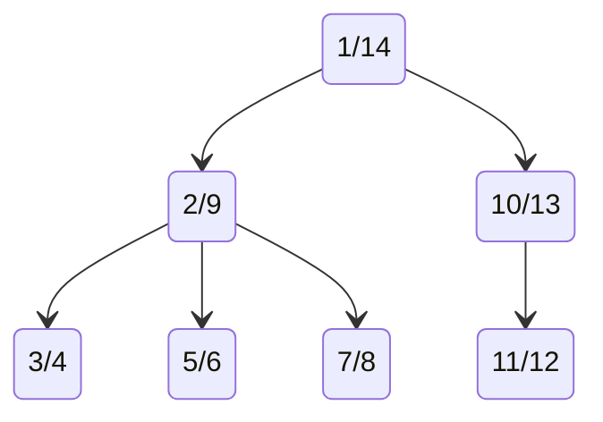
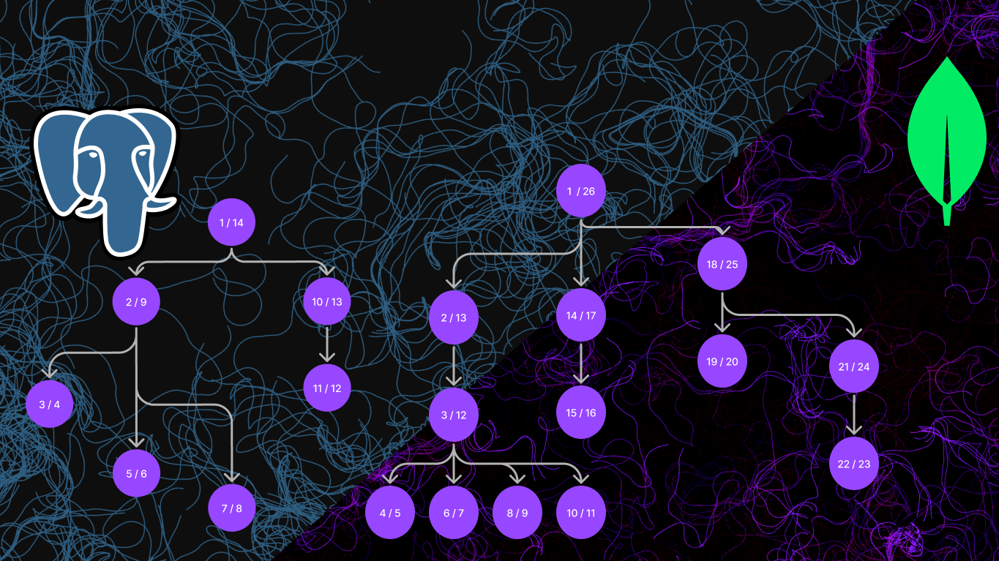

# Nested sets trees (youtube code)

The graph in the videos:

- [Starting video](https://youtu.be/MJIosbfiUs4)
- 🐉 Nested sets trees 🐉 [Playlist](https://youtube.com/playlist?list=PLM0LBHjz37LUgOrslWOJ2RcIJvWtxKIIz)
- 🐾 Adjacency List Model in SQL 🐾 [Playlist](https://youtube.com/playlist?list=PLM0LBHjz37LWA1cecQiIJd14NPXPLpmdK&si=hXLrPXIiJX4gLxqA)
- 🔱 Graphs & trees 🔱 [playlist](https://youtube.com/playlist?list=PLM0LBHjz37LVCh8zn3vH5xMobpTS7mhmY)
- [PostgreSQL code](./nested_sets_postgresql/)
- https://github.com/Rowadz/adjacency-list-model-in-sql
