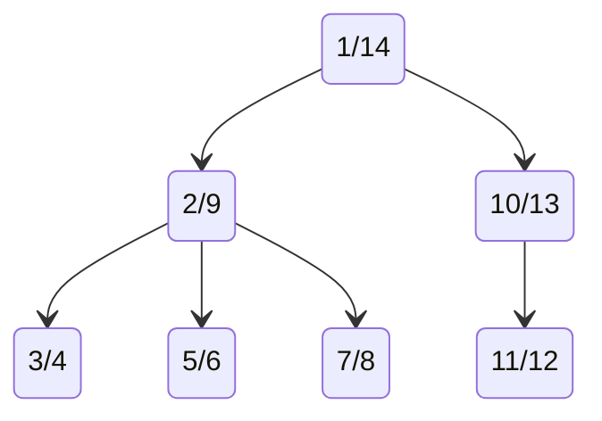

Here you can find the SQL code for the nested sets model written in PostgreSQL `13.3-1.pgdg100+1`

The graph form the videos:

# SQL queries:

- [Create nodes table](https://github.com/Rowadz/nested-sets-trees-model-yt/blob/main/nested_sets_postgresql/00-create_nodes_table.sql)
- [Insert tree root](https://github.com/Rowadz/nested-sets-trees-model-yt/blob/main/nested_sets_postgresql/01-insert_tree_root.sql)
- [Add child](https://github.com/Rowadz/nested-sets-trees-model-yt/blob/main/nested_sets_postgresql/02-add_child.sql)
- [Cut off branch](https://github.com/Rowadz/nested-sets-trees-model-yt/blob/main/nested_sets_postgresql/03-cut_off_branch.sql)
- [Delete node and uplift the descendants](https://github.com/Rowadz/nested-sets-trees-model-yt/blob/main/nested_sets_postgresql/04-delete_node_and_uplift_the_descendants.sql)
- [Create example tree](https://github.com/Rowadz/nested-sets-trees-model-yt/blob/main/nested_sets_postgresql/05-create_example_tree.sql)
- [Get descendants for any node](https://github.com/Rowadz/nested-sets-trees-model-yt/blob/main/nested_sets_postgresql/06-get_descendants_for_any_node.sql)
- [Get leaf nodes](https://github.com/Rowadz/nested-sets-trees-model-yt/blob/main/nested_sets_postgresql/07-get_leaf_nodes.sql)
- [Finding the depth of the nodes](https://github.com/Rowadz/nested-sets-trees-model-yt/blob/main/nested_sets_postgresql/08-finding_the_depth_of_the_nodes.sql)
